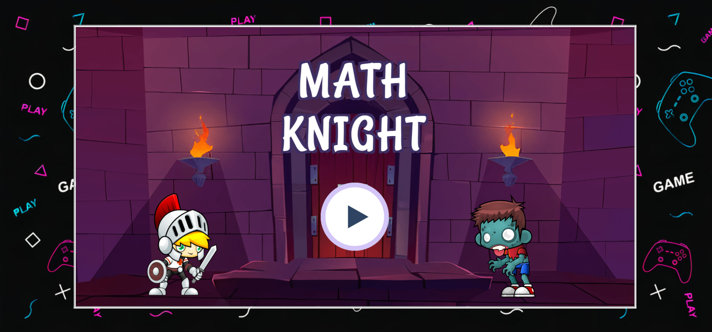
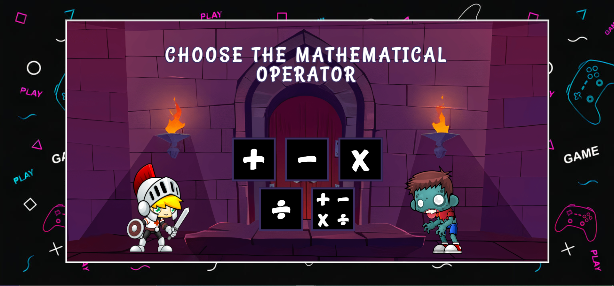
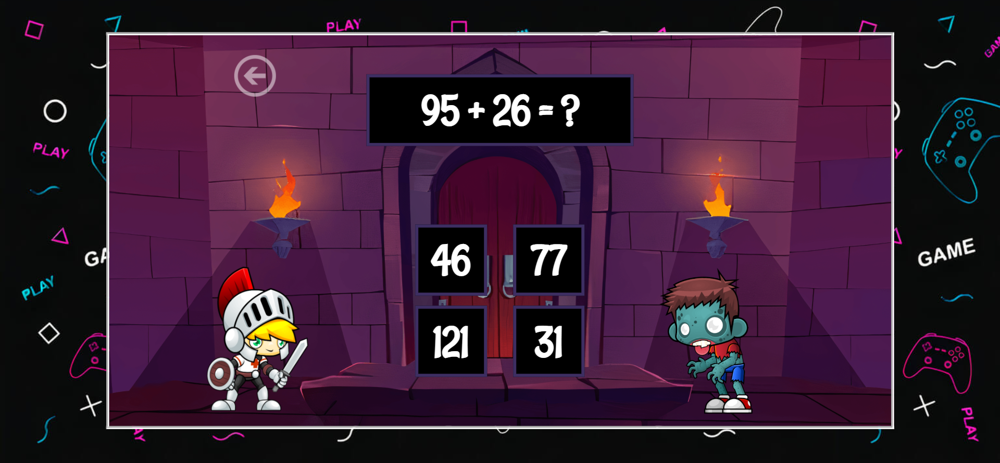
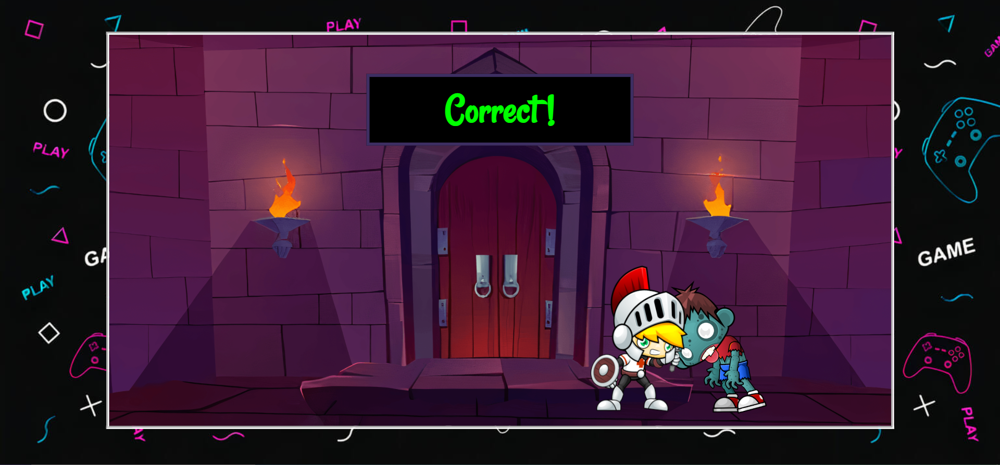
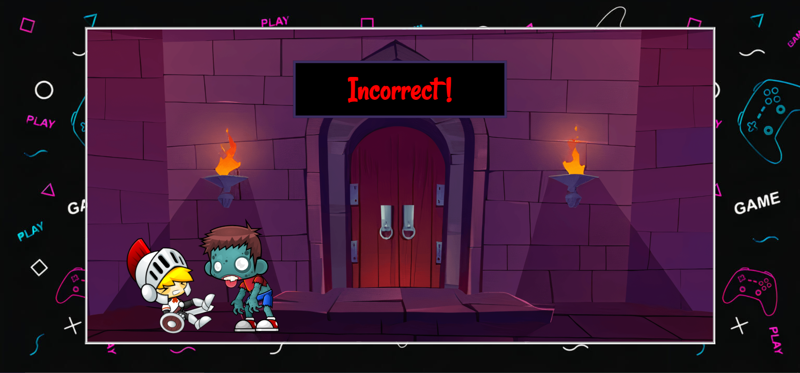

# Math Knight
Math Knight is a fantasy themed mathematical operations game build on pure HTML, CSS and JavaScript. This game focuses on basic mathematical calculations which helps in sharpening young minds. 
### What it does?
The player has to choose from 5 modes: Addition, Subtraction, Multiplication, Division or a combination of all arithmetic operations. The player then needs to solve an infinite number of equations correctly. To make the game interesting and fantasy-driven, for each round of questions, if the player answers a question correctly, the knight runs towards the zombie and stabs him. On choosing the wrong option, the zombie walks towards the knight and attacks him. The player then moves to the next question. 
### Tech stack: 

### Play game: https://themathknight.netlify.app/

## Contributing Guidelines
Do you want to add a new feature 💡 to our project? Did you experience a bug 🐛 while going through the project? Please go through our [contribution Guidlines](Contributing.md) and feel free to contribute ✨ to MathKnight.

## Screenshots:

